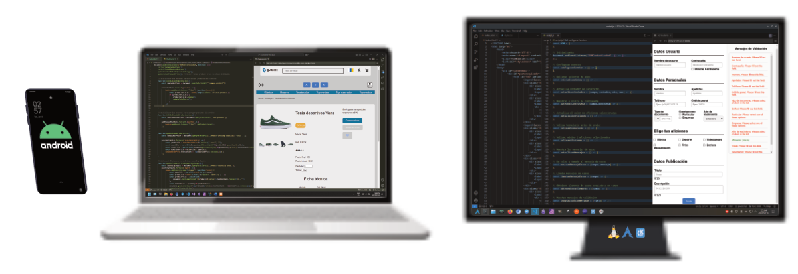

# Hi there 👋

These are the languages, tools and software that I use for software development:

## Languages

| **Category**    | **Items**                                                                                                                                                                                                                                                                                                                                                                                                                                                                                                                                               |
| --------------- | ------------------------------------------------------------------------------------------------------------------------------------------------------------------------------------------------------------------------------------------------------------------------------------------------------------------------------------------------------------------------------------------------------------------------------------------------------------------------------------------------------------------------------------------------------- |
| **Human**       |                                                                                                                                                                                                                                                                                                                                                                                                                                           |
| **Programming** |                                                                                                                                                                                                  |
| **Markup**      |                                                                                                                                                                                                                                                                         |
| **Styling**     |                                                                                                                                                                                                                                                                                                                                                                                                                                                                    |
| **SQL**         |                                                                                                                                                                                                                                        |
| **Web lib**     |       |

## Software

| **Category**       | **Items**                                                                                                                                                                                                                                                                                                                               |
| ------------------ | --------------------------------------------------------------------------------------------------------------------------------------------------------------------------------------------------------------------------------------------------------------------------------------------------------------------------------------- |
| **OS**             |                                 |
| **Code editors**   |    |
| **Design**         |                              |
| **Productivity**   |                                                                                                                                                                                                                                      |
| **Sync**           |                                                     |
| **Virtualization** |                                          |
| **Web browser**    |                                                                                                                               |
| **Web server**     |                                                        |

More [about me here](https://david7ce.github.io/about).

