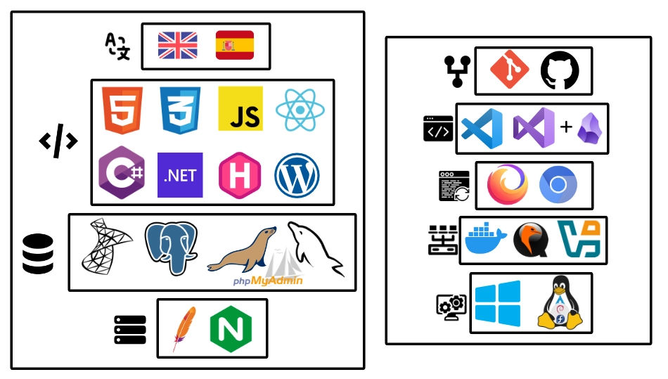

# Hi there 👋

These are the languages and tools that I use for software development:

| Langs                                                                                                                                                                                                                                                                                          |   | Tools                                                                                                                                             |
|------------------------------------------------------------------------------------------------------------------------------------------------------------------------------------------------------------------------------------------------------------------------------------------------|---|---------------------------------------------------------------------------------------------------------------------------------------------------|
|                                                                                                                                                        |   |                                                  |
|     |   |   |
|  ](https://www.postgresql.org/)                                                                                          |   |         |
|                                                                                                                                                                                                                             |   |                         |                                                                                                                                                   |
|                                                                                                                                                                                       |   |                      |                                                                                                                                                   |

More [about me here](https://david7ce.github.io/about).

<!--
| Langs                                                                                                                                                                                                                                                                                                                                                                                                                                                       |     | Tools                                                                                                                                                                                                                                                                                                                                                                                                                                                 |
|-------------------------------------------------------------------------------------------------------------------------------------------------------------------------------------------------------------------------------------------------------------------------------------------------------------------------------------------------------------------------------------------------------------------------------------------------------------|-----|-------------------------------------------------------------------------------------------------------------------------------------------------------------------------------------------------------------------------------------------------------------------------------------------------------------------------------------------------------------------------------------------------------------------------------------------------------|
|                                                                                                                                                                               |     |                                                                           |
|     |     |   |
|                                         |     |     |
|                                                            |     |                                                     |
|                                                                         |     |                              |
-->

<!--
<h2 align="center">Hi there 👋</h2>

These are the languages and tools that I use for software development.

  

More <a href="https://david7ce.github.io/about/">about me here.</a>

-->

<!--

  
<b>Languages:</b>

  

    <ul>
      <li><b>Human</b>: Spanish, English</li>
      <li><b>Markup</b>: HTML, MD</li>
      <li><b>Programming</b>: C#, JS, (PHP)</li>
      <li><b>Styling</b>: CSS</li>
      <li><b>SQL</b>: MySQL, PostgresSQL, T-SQL</li>
      <li><b>Web-lib</b>: ASP.NET, Astro-JS, HUGO, React, (Laravel)</li>
    </ul>
  

  
<b>Software:</b>

  

  <ul>
      <li><b>OS</b>: Windows (10/11), Linux (Arch, Debian, Fedora)</li>
      <li><b>Code editor</b>: VS-Code, Visual-Studio</li>
      <li><b>Sync</b>: Git, Rsync, Syncthing, Borg</li>
      <li><b>Virtualization</b>: Docker, Qemu, Virtualbox</li>
      <li><b>Web-browser</b>: Chromium, Firefox</li>
      <li><b>Web-server</b>: Apache, Nginx</li>
    </ul>
  

-->

<!--
<table>
  <tr>
    <td></td>
    <td></td>
  </tr>
  <tr>
    <td colspan="2" style="text-align: center;"></td>
  <tr>
</table> 
-->

<!--
| **Languages**   | Names                                                                                                                                                                                                                                                                                                                                                                                |   |  **Software Dev Kit** | Names                                                                                                                                                                                                                                                                                                                                    |
| :-------------: | :----------------------------------------------------------------------------------------------------------------------------------------------------------------------------------------------------------------------------------------------------------------------------------------------------------------------------------------------------------------------------------- | - |  :------------------: | :--------------------------------------------------------------------------------------------------------------------------------------------------------------------------------------------------------------------------------------------------------------------------------------------------------------------------------------- |
| **Human**       |                                                                                                                                                                                                                                                                                                                                                |   | **Operating System**  |                      | 
| **Markup**      |                                                                                                                                                                               |   |  **Code editor**      |    |
| **Programming** |  Badge](https://img.shields.io/badge/-Bash-444444?style=flat&logo=GNU%20Bash)    |   |  **Sync**             |                                    |
| **Styling**     |                                                                                                                                                                                                                                                                                                                                                                                |   |  **Virtualization**   |                  |
| **SQL**         |                                                                                                                                        |   |  **Web browser**      |                                                                                                                    |
| **Web lib**     |                                                                                                                                                                                                |   |  **Web server**       |                                       |
-->

<!--
> [!NOTE]
> Every software produce a change on the hardware and viceversa.
-->

<!--

-->
